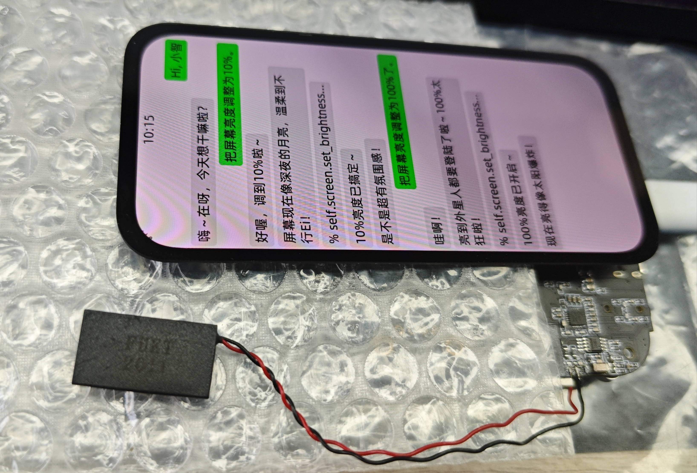

<!--
 * @Description: None
 * @Author: LILYGO_L
 * @Date: 2025-06-13 15:12:02
 * @LastEditTime: 2025-10-16 14:44:17
 * @License: GPL 3.0
-->
<h1 align = "center">T-Display-P4</h1>

## **[English](./README.md) | 中文**

## 版本迭代:
| Version                               | Update date                       |Update description|
| :-------------------------------: | :-------------------------------: |:--------------: |
| T-Display-P4_V1.0                      | 2025-06-13                    |   初始版本      |
| T-Display-P4-Keyboard_V1.0                      | 2025-09-12                    |   初始版本      |

## 购买链接

| Product                     | SOC           |  FLASH  |  PSRAM   | Link                   |
| :------------------------: | :-----------: |:-------: | :---------: | :------------------: |
| T-Display-P4_V1.0   | NULL |   NULL   | NULL |  [NULL]()   |

## 目录
- [描述](#描述)
- [预览](#预览)
- [模块](#模块)
- [软件部署](#软件部署)
- [引脚总览](#引脚总览)
- [相关测试](#相关测试)
- [常见问题](#常见问题)
- [项目](#项目)

## 描述

T-Display-P4是基于ESP32-P4核心开发的多功能板，该产品的特点包括：

1.  **高处理能力**：搭载高性能核心处理器ESP32-P4，能够处理更复杂的图形和视频任务，提供更流畅的显示效果。
2.  **低功耗设计**：具有多种可选的工作模式，能够有效降低功耗，延长电池寿命。
3.  **高分辨率显示**：具有较高的分辨率（默认搭配MIPI接口大屏，分辨率为540x1168px），提供清晰的显示效果。
4.  **丰富的外设支持**：板载高清MIPI触摸屏、ESP32-C6模块、扬声器、麦克风、Lora模块、Gps模块、以太网、线性振动马达、独立的电池电量监测计可监测电池健康度和电量百分比、MIPI摄像头等，引出了ESP32-P4和ESP32-C6的多个IO口，提高了设备的可扩展性。

## 预览
### 预览版测试图片

    

---

    

---

    

### 实物图

## 模块

### T-Display-P4部分
### 1. 核心处理器

* 芯片：ESP32-P4
* FLASH：16M
* 相关资料：
    >[Espressif](https://www.espressif.com/en/support/documents/technical-documents)

### 2. 辅助处理器

* 模组：ESP32-C6-MINI-1U
* FLASH：16M
* 芯片：ESP32-C6-FH4
* PSRAM：4M 
* FLASH：-
* 通信协议：SDIO
* 其他说明：更多资料请访问 [乐鑫官方ESP32-C6-MINI-1U数据手册](https://www.espressif.com/sites/default/files/documentation/esp32-c6-mini-1_mini-1u_datasheet_en.pdf)

### 3. 屏幕和触摸

> #### 型号：H0405S002T002-V0
> * 显示尺寸(对角线)：4.05 inch
> * 液晶显示屏类型：α-Si TFT
> * 分辨率：540(H) × 1168(V) px
> * 显示区：41.9904(H) × 91.1040(V) mm
> * 模组外形：44(H) × 95.5(V) × 1.46(T) mm
> * 显示颜色：16.7M
> * 屏幕通讯接口：MIPI
> * 触摸通讯接口：IIC
> * 屏幕和触摸驱动芯片：HI8561
> * 触摸最大点数：10点触控
> * 亮度：550 cd/m²
> * 视角方向：All
> * 对比度：1200:1
> * 色域：70%
> * 图像点密集度：326
> * 视窗效果：无一体黑
> * 盖板表面效果：无 AF/AG
> * 工作温度：-20～70  ºC
> * 储存温度：-30～80 ºC
> * 相关资料：
>    >[H0405S002T002-V0](./information/H0405S002T002-V0_4.05inch_540x1168px_MIPI.pdf)  
>    >[HI8561](./information/HI8561_Preliminary%20_DS_V0.00_20230511.pdf)

> #### 型号：H0410S001AMT001-V0
> * 显示尺寸(对角线)：4.1 inch
> * 液晶显示屏类型：α-Si AMOLED
> * 分辨率：568(H) × 1232(V) px
> * 显示区：43.55(H) × 94.47(V) mm
> * 模组外形：45.6(H) × 97.22(V) × 0.7(T) mm
> * 显示颜色：16.7M
> * 屏幕通讯接口：MIPI
> * 触摸通讯接口：IIC
> * 屏幕驱动芯片：RM69A10
> * 触摸驱动芯片：GT9895
> * 触摸最大点数：10点触控
> * 亮度：500 cd/m²
> * 视角方向：All
> * 对比度：20000:1
> * 色域：100%
> * 图像点密集度：190
> * 视窗效果：无一体黑
> * 盖板表面效果：无 AF/AG
> * 工作温度：-20～70  ºC
> * 储存温度：-30～80 ºC
> * 相关资料：
>    >[H0410S001AMT001-V0](./information/H0410S001AMT001-V0_4.1inch_568X1232px_MIPI_AMOLED.pdf)  
>    >[RM69A10](./information/RM69A10_DataSheet_V0.2_20230330 (Public version).pdf)  
>    >[GT9895](./information/GT9895_Datasheet_V1.1.pdf)

* 依赖库：
    >[cpp_bus_driver](https://github.com/Llgok/cpp_bus_driver)

### 4. 扬声器和麦克风

* DAC芯片：ES8311
* 功放芯片：NS4150B
* 麦克风芯片：mic咪头
* 通信协议：IIS
* 相关资料：
    >[ES8311](./information/ES8311.pdf)  
    >[NS4150B](./information/NS4150B.pdf)
* 依赖库：
    >[cpp_bus_driver](https://github.com/Llgok/cpp_bus_driver)

### 5. 振动

* 驱动芯片：AW86224AFCR
* 通信协议：IIC
* 相关资料：
    >[AW86224](./information/AW86224AFCR.pdf)
* 依赖库：
    >[cpp_bus_driver](https://github.com/Llgok/cpp_bus_driver)

### 6. LoRa

* 模组：HPD16A
* 芯片：SX1262、SKY13453-385LF
* 通信协议：标准SPI
* 其他说明：使用专用射频模拟开关开切换天线
* 相关资料：
    >[HPD16A](./information/HPDTEK_HPD16A_TCXO_V1.1.pdf)  
    >[SX1261-2](./information/DS_SX1261-2_V2_1.pdf)
* 依赖库：
    >[cpp_bus_driver](https://github.com/Llgok/cpp_bus_driver)

### 7. GPS

* 模组：L76k
* 通信协议：Uart
* 相关资料：
    >[L76K](./information/L76KB-A58.pdf)
* 依赖库：
    >[cpp_bus_driver](https://github.com/Llgok/cpp_bus_driver)

### 8. RTC

* 芯片：PCF8563
* 通信协议：IIC
* 相关资料：
    >[PCF8563](./information/PCF8563.pdf)
* 依赖库：
    >[cpp_bus_driver](https://github.com/Llgok/cpp_bus_driver)

### 9. 充电芯片

* 芯片：LGS4056H
* 其他说明：三线电池NTC引脚连接在充电芯片LGS4056H上，充电过温保护由芯片自动控制
* 相关资料：
   >[LGS4056H](./information/LGS4056H.pdf)

### 10. 电量监测计

* 芯片：BQ27220
* 通信协议：IIC
* 相关资料：
    >[BQ27220](./information/bq27220_en.pdf)
* 依赖库：
    >[cpp_bus_driver](https://github.com/Llgok/cpp_bus_driver)

### 11. 摄像头

> #### 型号：OV2710
> * 通讯接口：MIPI
> * 相关资料：
>    >[OV2710](./information/OV2710_CSP3_DS_2.0_KING%20HORN%20ENTERPRISES%20Ltd..pdf)

### 12. 惯性传感器

* 芯片：ICM20948
* 通信协议：IIC
* 相关资料：
    >[ICM20948](./information/ICM20948.pdf)
* 依赖库：
    >[arduino_cpp_bus_driver](https://github.com/Llgok/arduino_cpp_bus_driver)  
    >[cpp_bus_driver](https://github.com/Llgok/cpp_bus_driver)  
    >[ICM20948_WE](https://github.com/Llgok/ICM20948_WE)

### 13. IO扩展

* 芯片：XL9535
* 通信协议：IIC
* 相关资料：
    >[XL9535](./information/XL95x5.pdf)
* 依赖库：
    >[cpp_bus_driver](https://github.com/Llgok/cpp_bus_driver)  

### T-Display-P4-Keyboard部分
### 1. 键盘驱动

* 芯片：TCA8418
* 通信协议：IIC
* 相关资料：
    >[TCA8418](./information/tca8418.pdf)
* 依赖库：
    >[cpp_bus_driver](https://github.com/Llgok/cpp_bus_driver)  

### 2. 键盘背光驱动

* 芯片：SY7200A
* 通信协议：PWM
* 相关资料：
    >[SY7200A](./information/SY7200AABC.pdf)

### 3. IO扩展

* 芯片：XL9555
* 通信协议：IIC
* 相关资料：
    >[XL9555](./information/XL95x5.pdf)
* 依赖库：
    >[cpp_bus_driver](https://github.com/Llgok/cpp_bus_driver)  

### 4. CC1101

* 模组：T-MixRF
* 芯片：CC1101
* 通信协议：标准SPI
* 其他说明：T-Display-P4-Keyboard板子上的T-MixRF模组将不使用LR1121芯片
* 相关资料：
    >[CC1101](./information/cc1101.pdf)
* 依赖库：
    >[cpp_bus_driver](https://github.com/Llgok/cpp_bus_driver)  
    >[RadioLib](https://github.com/jgromes/RadioLib)  

### 5. NRF24L01

* 模组：T-MixRF
* 芯片：NRF24L01
* 通信协议：标准SPI
* 其他说明：T-Display-P4-Keyboard板子上的T-MixRF模组将不使用LR1121芯片
* 相关资料：
    >[NRF24L01](./information/NRF24L01P-R.pdf)
* 依赖库：
    >[cpp_bus_driver](https://github.com/Llgok/cpp_bus_driver)  
    >[RadioLib](https://github.com/jgromes/RadioLib)  

### 6. NFC

* 模组：T-MixRF
* 芯片：ST25R3916
* 通信协议：标准SPI
* 其他说明：T-Display-P4-Keyboard板子上的T-MixRF模组将不使用LR1121芯片
* 相关资料：
    >[ST25R3916](./information/st25r3916.pdf)
* 依赖库：
    >[arduino_cpp_bus_driver](https://github.com/Llgok/arduino_cpp_bus_driver)  
    >[cpp_bus_driver](https://github.com/Llgok/cpp_bus_driver)  
    >[ST25R3916](https://github.com/stm32duino/ST25R3916)  
    >[NFC-RFAL](https://github.com/stm32duino/NFC-RFAL)

## 软件部署

### 示例支持

#### T-Display-P4 示例
| example | `[vscode][esp-idf-v5.4.0]` | description | picture |
| ------  | ------ | ------ | ------ | 
| [afe](./main/examples/afe) |  
![alt text][supported] | | |
| [aw86224](./main/examples/aw86224) |  
![alt text][supported] | | |
| [bq27220](./main/examples/bq27220) |  
![alt text][supported] | | |
| [deep_sleep](./main/examples/deep_sleep) |  
![alt text][supported] | | |
| [es8311](./main/examples/es8311) |  
![alt text][supported] | | |
| [es8311_sd_wav](./main/examples/es8311_sd_wav) |  
![alt text][supported] | | |
| [esp_hosted_mcu_sdio_wifi](./main/examples/esp_hosted_mcu_sdio_wifi) |  
![alt text][supported] | | |
| [esp32c6_at_host_sdio_uart](./main/examples/esp32c6_at_host_sdio_uart) |  
![alt text][supported] | | |
| [esp32c6_at_host_sdio_wifi](./main/examples/esp32c6_at_host_sdio_wifi) |  
![alt text][supported] | | |
| [icm20948](./main/examples/icm20948) |  
![alt text][supported] | | |
| [iic_scan](./main/examples/iic_scan) |  
![alt text][supported] | | |
| [l76k](./main/examples/l76k) |  
![alt text][supported] | | |
| [lvgl_9_ui](./main/examples/lvgl_9_ui) |  
![alt text][supported] |出厂示例 | |
| [pcf8563](./main/examples/pcf8563) |  
![alt text][supported] | | |
| [radiolib_sx1262_send_receive](./main/examples/radiolib_sx1262_send_receive) |  
![alt text][supported] | | |
| [screen_camera](./main/examples/screen_camera) |  
![alt text][supported] | | |
| [screen_lvgl](./main/examples/screen_lvgl) |  
![alt text][supported] | | |
| [screen_lvgl_touch_draw](./main/examples/screen_lvgl_touch_draw) |  
![alt text][supported] | | |
| [sgm38121](./main/examples/sgm38121) |  
![alt text][supported] | | |
| [sx1262_gfsk_send_receive](./main/examples/sx1262_gfsk_send_receive) |  
![alt text][supported] | | |
| [sx1262_lora_send_receive](./main/examples/sx1262_lora_send_receive) |  
![alt text][supported] | | |
| [sx1262_tx_continuous_wave](./main/examples/sx1262_tx_continuous_wave) |  
![alt text][supported] | | |
| [tusb_serial_device](./main/examples/tusb_serial_device) |  
![alt text][supported] | | |
| [xl9535](./main/examples/Vibration_Motor) |  
![alt text][supported] | | |
| [xiaozhi](https://github.com/78/xiaozhi-esp32) |  
![alt text][supported] | | |

#### T-Display-P4-Keyboard 示例
| example | `[vscode][esp-idf-v5.4.0]` | description | picture |
| ------  | ------ | ------ | ------ | 
| [radiolib_cc1101_send_receive](./main/keyboard_examples/radiolib_cc1101_send_receive) |  
![alt text][supported] | | |
| [radiolib_nrf24l01_send_receive](./main/keyboard_examples/radiolib_nrf24l01_send_receive) |  
![alt text][supported] | | |
| [screen_tca8418_lvgl_touch_draw](./main/keyboard_examples/screen_tca8418_lvgl_touch_draw) |  
![alt text][supported] | | |
| [st25r3916](./main/keyboard_examples/st25r3916) |  
![alt text][supported] | | |
| [tca8418](./main/keyboard_examples/tca8418) |  
![alt text][supported] | | |
| [xl9555](./main/keyboard_examples/xl9555) |  
![alt text][supported] | | |

[supported]: https://img.shields.io/badge/-supported-green "example"

| firmware | description | picture |
| ------  | ------  | ------ |
| [t_display_p4_lvgl_9_ui](./firmware/[T-Display-P4][lvgl_9_ui]) | 出厂程序 |  |
| [t_display_p4_keyboard_lvgl_9_ui](./firmware/[T-Display-P4-Keyboard][lvgl_9_ui]) | 键盘扩展板出厂程序 |  |
| [esp32c6_at](./firmware/[T-Display-P4][esp32c6_at_slave]) | esp32c6-at 出厂程序 |  |
| [esp32c6_slave_esp_hosted_mcu_network_adapter](./firmware/[T-Display-P4][esp32c6_slave_esp_hosted_mcu_network_adapter]) |  |  |
| [t_display_p4_xiaozhi](./firmware/[T-Display-P4][xiaozhi]) |  |  |

### ESP-IDF Visual Studio Code
1. 安装 [Visual Studio Code](https://code.visualstudio.com/Download) ，根据你的系统类型选择安装。

2. 打开 VisualStudioCode 软件侧边栏的“扩展”（或者使用<kbd>Ctrl</kbd>+<kbd>Shift</kbd>+<kbd>X</kbd>打开扩展），搜索“ESP-IDF”扩展并下载。

3. 在安装扩展的期间，使用git命令克隆仓库

        git clone --recursive https://github.com/Xinyuan-LilyGO/T-Display-P4.git

    克隆时候需要同时加上“--recursive”，如果克隆时候未加上那么之后使用的时候需要初始化一下子模块

        git submodule update --init --recursive

4. 下载安装 [ESP-IDF v5.4.1](https://dl.espressif.cn/dl/esp-idf/?idf=4.4)，记录一下安装路径，打开之前安装好的“ESP-IDF”扩展打开“配置 ESP-IDF 扩展”，选择“USE EXISTING SETUP”菜单，选择“Search ESP-IDF in system”栏，正确配置之前记录的安装路径：
   - **ESP-IDF directory (IDF_PATH):** `你的安装路径xxx\Espressif\frameworks\esp-idf-v5.4`  
   - **ESP-IDF Tools directory (IDF_TOOLS_PATH):** `你的安装路径xxx\Espressif`  
    点击右下角的“install”进行框架安装。

5. 点击 Visual Studio Code 底部菜单栏的 ESP-IDF 扩展菜单“SDK 配置编辑器”，在搜索栏里搜索“Select the example to build”字段，选择你所需要编译的项目，再在搜索栏里搜索“Select the camera type”字段，选择你的板子板载的摄像头类型，点击保存。

6. 点击 Visual Studio Code 底部菜单栏的“设置乐鑫设备目标”，选择**ESP32P4**，点击底部菜单栏的“构建项目”，等待构建完成后点击底部菜单栏的“选择要使用的端口”，之后点击底部菜单栏的“烧录项目”进行烧录程序。

    

### firmware烧录
1. 打开项目文件“tools”找到ESP32烧录工具，打开。

2. 选择正确的烧录芯片以及烧录方式点击“OK”，如图所示根据步骤1->2->3->4->5即可烧录程序，如果烧录不成功，请按住“BOOT-0”键再下载烧录。

3. 烧录文件在项目文件根目录“[firmware](./firmware/)”文件下，里面有对firmware文件版本的说明，选择合适的版本下载即可。

    
    

## 引脚总览

引脚定义请参考配置文件：
 

[t_display_p4_config.h](./components/private_library/t_display_p4_config.h)  
[t_display_p4_keyboard_config.h](./components/private_library/t_display_p4_keyboard_config.h)

## 相关测试

### 功耗
| firmware | program | description | picture |
| ------  | ------  | ------ | ------ | 
| [deep_sleep(single_board)](./firmware/sleep/[T-Display-P4][deep_sleep][single_board]_firmware_202505301450.bin) |[deep_sleep](./main/examples/deep_sleep/)| 平均电流消耗: 1.2mA 更多信息请查看 [功耗测试日志](./relevant_test/PowerConsumptionTestLog_[T-Display-P4_V1.0]_20250605.pdf) | |

### 摄像头
| program | description | picture |
| ------  | ------ | ------ | 
| [uvc_sc2336](./debug/examples/uvc_sc2336/)| 原图和拍摄屏幕图片截图效果 | 
  
 |
| [uvc_ov2710](./debug/examples/uvc_ov2710/)| 原图和拍摄屏幕图片截图效果 | 
  
 |

## 常见问题

* Q. 看了以上教程我还是不会搭建编程环境怎么办？
* A. 如果看了以上教程还不懂如何搭建环境的可以参考[LilyGo-Document](https://github.com/Xinyuan-LilyGO/LilyGo-Document)文档说明来搭建。

 

* Q. 为什么我的板子一直烧录失败呢？
* A. 请按住“BOOT”按键重新下载程序。

 

* Q. 为什么我使用espidf框架在选择目标编译芯片或者在配置SDK的menuconfig的时候配置失败，报以下错误：

        asyncio.exceptions.LimitOverrunError: Separator is found, but chunk is longer than limit

        ValueError: Separator is found, but chunk is longer than limit

* A. 这个是espidf框架v5.4~v5.5的一个bug，需要将路径为 `esp-idf-v5.x\tools\idf_py_actions\tools.py` 文件的第351行做如下修改：

        原始代码：
        p = await asyncio.create_subprocess_exec(*cmd, env=env_copy, limit=1024 * 256, cwd=self.cwd, stdout=asyncio.subprocess.PIPE,stderr=asyncio.subprocess.PIPE)
        修改后的代码：
        p = await asyncio.create_subprocess_exec(*cmd, env=env_copy, limit=1024 * 512, cwd=self.cwd, stdout=asyncio.subprocess.PIPE,stderr=asyncio.subprocess.PIPE)

## 项目
* 
